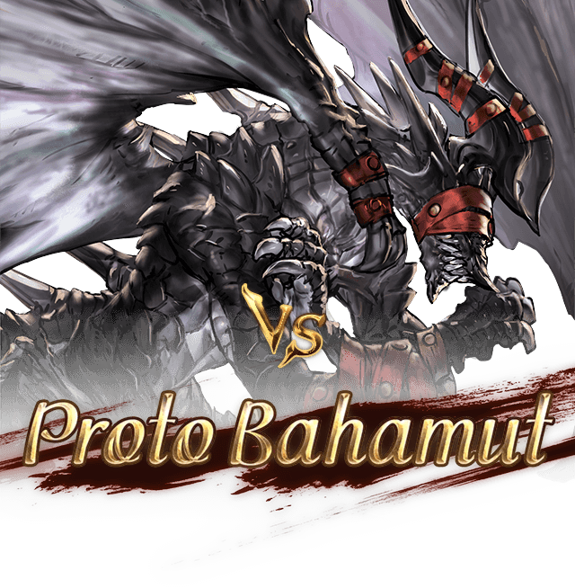
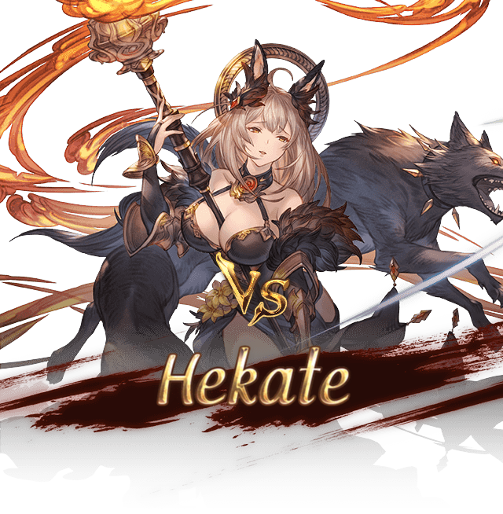
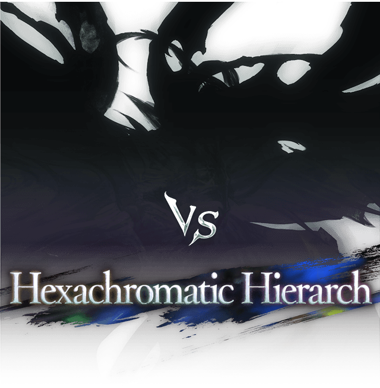
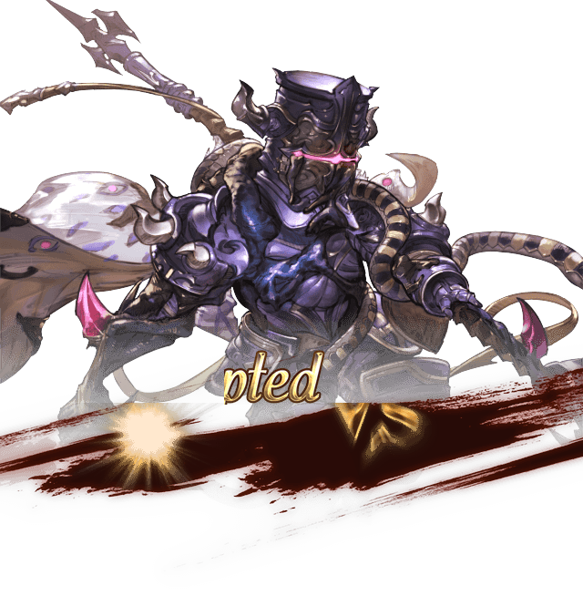

# Granblue Fantasy Raid Appear  
  
Standalone Python script reusing code from [Mizatube](https://github.com/MizaGBF/Mizatube) to generate an image of a Granblue Fantasy "Raid Appear" animation.
  
# Requirements  
  
`pip install -r requirements.txt` to install all the modules. 
  
# Usage  
  
```console
python gbfra.py --id ENEMY_ID --variation VARIATION_SUFFIX --output FILE_NAME.png
```  
  
`ENEMY_ID` must be a 7-digit number matching an enemy with a "Raid Appear" animation. You can look for them on [GBFAL](https://mizagbf.github.io/GBFAL/), such enemies have a little "Vs" icon.  
`VARIATION` is the extra string present on alternative animations.  
The `output` will always be a `PNG` regardless of the extension that you might input or not.  
`--variation` and `--output` are optional.  
Use `-h/--help` for the help and the shorthands.  
Look below for examples.  
  
# Examples  
  
### Proto Bahamut  
  
```console
python gbfra.py --id 7300213
```  
  
  
### Hekate  
  
```console
python gbfra.py --id 8103893
```  
  
  
### Vyrn? (4th variation)  
  
```console
python gbfra.py --id 9101463 --variation 4
```  
  
  
### Hexachromatic Hierarch (Spoiler variation)  
  
```console
python gbfra.py --id 7300843 --variation shade
```  
  
  
# Known issues  
  
Violet Knight (Otherworld Corrupted) doesn't work properly:  
  